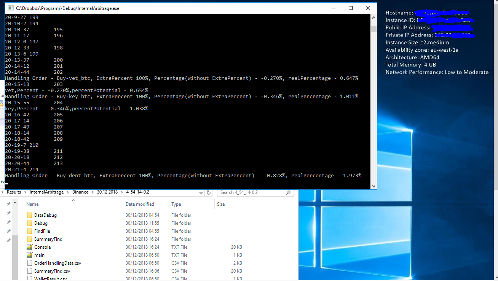
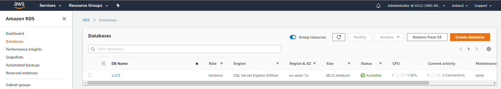

# [crypto-arbitrage-bot_v0]((https://github.com/ShalomMalovicki/crypto-arbitrage-bot_v0))
crypto-arbitrage-bot is an automatic arbitrage trading application targeting crypto exchanges.  The bot looks for profit opportunities arising from exchange rate differentials, in currency traded against different bases. In the case of identifying an opportunity, the bot automatically sends buy and sell orders to realize the profit [Extended explanation and example](#Extended-explanation)  **The software uses in methods and algorithms as follows:**   

**Machine learning -** Algorithms that use in various method  of analysis and statistics from transaction history data, In order to obtain the optimal percentages for use in  buy/sell orders In relation to the existing prices proposals (order book), In addition using in ML algorithms to set the optimal times wait for the next price/amount update […read more](#Machine-learning)

**Databases -**   The implementation is in SQL Server type, the DB supply by using in Amazon AWS RDS. The access and connection made by an extension of EntityFramework DbContext […read more](#Databases)

**Security -** Emphasis on the security of confidential information. Such as access passwords to databases and keys and passwords for trading on exchanges. I used three layers of security […read more](#Security)

**Generic -** writing and using generic functions and methods […read more](#Generic)

**Efficiency -** Writing and reusing in static functions & variables, for writing as short and clean a code as possible […read more](#Efficiency)

**Creative solutions for problems -** Examples of problems that arose during the project's construction and solution […read more](#Creative-solutions-for-problems)

**by value vs by reference -** A proper use for transferring variables to functions and changing their values […read more](#by-value-vs-by-reference)

**Debug -** Implementing extensive debug options throughout the software […read more](#Debug)

#

### Extended explanation
The bot looks for profit opportunities arising from exchange rate differentials, in currency traded against different bases.  
Currency -> In a pair like amb_btc, amb is the currency 
Base_1    -> In a pair like amb_btc, btc is the base 
Base_2    -> In a pair like amb_eth, eth is the base 
For example, the currency "Ambrosus". Which is traded against Ethereum and Bitcoin And we found an opportunity when the "Ambrosus" price to buy against the Ethereum base is lower than the price we sell the "Ambrosus" against the base of Bitcoin. When the comparison is made by converting the cost of an Ethereum in the Bitcoin currency, 
This is an opportunity to profit and therefore the bot will automatically launch 3 trading operations
* Buy coins "Ambrosus" by paying in Ethereum
* We will sell the Ambrosus coins we purchased when the income is in Bitcoin currency
* In the Bitcoin coins we received, we will buy back the amount of Ethereum we spent in the first stage

After 3 trades trading remains with a quantity of Bitcoin coins and that's our profit Link for [example](#An-example-of-an-opportunity-identified-and-implemented)

### Machine learning 
The possibility of finding an arbitrage opportunity in the market, according to the bids/asks in the order book is rare (The intention is to buy the currency in cheapest bid, and to sell the currency to highest asking). and therefore to increase the opportunities for arbitrage, I am using the strategy of sending new buy/sell orders that will be within range of That current highest ask-bid. The main factors influencing this strategy are as follows
1.	In each of the three trading stages, what is the optimal percentage from the range of difference between bis/ask to use for the new trading proposal? The higher the percentage, the greater profit and risk
2.	The waiting time at each price update for each trading step. The longer the time, the greater the chance of trading, but the higher the risk, because we have moved away from the time of the original price quote and when we update to this price, Perhaps the price of opportunity disappeared
3.	 The effect of the waiting time of each trading stage on the remaining trading stages

In conclusion, we need to reach optimal numbers here that are close to the chances and far from the risk. For this purpose, I wrote a machine learning algorithm that obtains past trading data from the database and by analyzing and statistics of the data, provides us with the best values for the current time point

simple example of a machine learning algorithm is ML_2. The purpose of this algorithm is to avoid futile efforts and waste of time when we are creating a new order price. We will indicate for each pair of currency and base whether there was success in raising the percentage, and in case of failure avoid from raising the percentage in the next few minutes according to the time value that appears in the MagicTimeHasPassed variable. The algorithm modifies the value of the variable by statistical calculation of past and present transactions. You can see the execution by tracking the MagicTimeHasPassed variable and/or searching for the // USE to ML_2 comment. [link](/InternalArbitrage/MachineLearning/ExtraPercent.cs)

expanded example of machine learning is ML_4. As we detailed in section 2-3 the value of time waiting between updates of the orders is a critical component in trade. In the algorithms used for ML_4, we change the above value in the WaitingTimeForNextPriceUpdate variable by analyzing the success/failure of each transaction and each arbitrage transaction, in addition, the algorithm updates the variable for symbols that have not yet been traded by statistical analyzes and calculations from the database. You can see the implementation of the above algorithms in class [WaitingTimeML](/InternalArbitrage/MachineLearning/WaitingTimeML.cs) & [TradeMagic](/InternalArbitrage/Func/TradeMagic.cs#L111) and in the search for comment // USE to ML_4 

### Databases
For ML algorithms we need a database. In this project I used SQL Server type. running on Amazon AWS RDS. I implemented the access and connection using by Microsoft Entity Framework 6 extension library. Using in DbContext simplifies procedures and is easy to implement for the following reasons.
* Automatically build tables by inheritance from DbContext, and that converts the "ExtraPercent" class  fields into columns  [link](/InternalArbitrage/DB/SqlContext.cs)
* The conversion from tables to class is also done automatically. [link](/InternalArbitrage/DB/SqlMagicNumber.cs#L34)
* Access and queries using by "linq" method without the need to implement conversion functions for text etc. [link](/InternalArbitrage/MachineLearning/WaitingTimeML.cs#L81)

### Security 
I used three layers of security [link](/InternalArbitrage/Func/Approval.cs)
1.	Encrypting the location of the password files used access to DB and access to Exchanges
2.	Encryption of access passwords in the .bin file * by using Crypt32.dll with the possibility of extracting information only from the computer where the keys were encrypted. [File creation link](/Main/Program.cs) 
3.	When the trading orders are sent to Exchanges. The passwords are encrypted by sha256 and sent encrypted to the stock exchange servers link
4.	In addition to avoid exposing the DB server name and user name and password in the App.config file I wrote the class [MyConfiguration](/InternalArbitrage/DB/MyConfiguration.cs) and only at run time does the software receive the access values from the encrypted file.

### Generic 
Writing and using generic functions & methods. for writing as short & clean code as possible. example in this [link](/Main/SharedFunctions/PrintFunc.cs) You can see prints functions for "List" or/and "Dictionary" regardless of class type

### Efficiency  
Writing reusable static functions Which are often used by many classes. in this [link](/InternalArbitrage/Func/PrintTable.cs) You can see several functions for printing tables that are used to "csv" table file, with caring for printing in relation to the table columns, 
In addition, the use of static variables to obtain values and lists during the run, prevents the need transfer arguments to functions. example the Reference to [this](/InternalArbitrage/Main/StaticVariables.cs) static class, is 255 times!

### Creative solutions for problems 
**Problem:** In order to access non-local database, we need to be defined in the "App.config" file, the setting values of the DB server name, user name, and password, which creates a security problem in the software 
**Solution:** I wrote the class MyConfiguration (which only during runtime gets its values from the encrypted file and adds them to the app settings without saving the data) [link](/InternalArbitrage/DB/MyConfiguration.cs), and when I am implementing the DbContext extension I used the base constructor to get the database connection data. [link](/InternalArbitrage/DB/SqlContext.cs#L18)
 
**Problem:** How to represent a uniform value for a currency traded against different bases 
**Solution:** Examining the largest common base (usually Bitcoin) and converting the various bases to its value so that all base prices are represented by a single value, in this [link](/InternalArbitrage/Func/WalletFunc.cs#L104) You can see the use of conversion functions that maintain static lists of two-way conversion values and return a uniform value (The reference to this static function is 18 times)

**Problem:** How to calculate the profit when certain exchanges (Binance) are rounding the price & quantity of trading, Plus we need to calculate the trading commissions out of the amount of currencies we buy and sell (on certain exchanges like Bitfinex) 
**Solution:** Calculate from the order details received from the API, in this [link](/InternalArbitrage/Model/Trade%20package.cs#L224), Plus change the quantities in this [link](/InternalArbitrage/Func/TradeMagic.cs#L42)

### by value vs by reference
Because we use current trading data for the next trading, For example percent difference, wait times, etc. therefore is important to use in "by reference" Method (Default in C# ) when we use in class "SymbolsDate" (Which contains all the data needed for the next trade), We take this class from "StaticVariables.symbolsDateList" and so when we modified the "ExtraPercent" values during trading, the data modifies in the original list and are used for the next round [link](/InternalArbitrage/Model/FindingSymbolsTrading.cs#L127)  
In cases where we don't want to change the original variable, we use in "by value" method, example in the [link](/InternalArbitrage/Model/OrderTrade.cs#L510)

### Debug 
Today I work in the FwDebug team at Intel. My experience at work taught me about the importance of Debug, Validation, Testing, In the life cycle of software development, and therefore can be found in the code a lot of prints to logs. Tables, etc. So that there are possibilities for verifying and testing the algorithms & options in the case of a bug get the variables values. For example, searching for the "#if DEBUG" string in code, brings 37 results

### An example of an opportunity identified and implemented
* *Buy 49 "Ambrosus" coins, Quoted base "Ethereum" symbol amb_eth. Purchase price 0.00072768, Total buy cost is - 0.03565632 Ethereum
* Sell 49 "Ambrosus" coins, Quoted base "Bitcoin" symbol amb_btc . Selling price 0.00002042, The total sell cost is - 0.00100058 Bitcoin
* Buy 0.03565632 "Ethereum" coins (The first purchase cost), Quoted base "Bitcoin" symbol eth_btc. Selling price 0.0278699, The total sell cost is -0.000993738 Bitcoin 

The amount of "Bitcoin" we received (0.00100058) minus the cost of buying the "Ethereum" back (0.000993738) leaves us a profit of 0.00000684 "Bitcoin", in calculating the profit towards the cost, the percentage of profit is 0.689% 
A screenshot of the example from the main.txt file
 
#

### Test & run
This version of the bot has been tested. and now operates on Amazon AWS in EC2 Instance type  t2.medium 
Screenshot of the test  

Screenshot of DB_Query  
   
Screenshot of Amazon AWS RDS 

 
# 

### Licensed & Copyright
This project is licensed under the MIT License, each file separately has a license and copyright based on the participants writing and modifying the file 
In "Main" Project The folder " Utility " has been copied from [jjxtra/ExchangeSharp](https://github.com/jjxtra/ExchangeSharp) And I did not change them 
In "Main" Project The following folders "Model" & " API" have been copied from [jjxtra/ExchangeSharp](https://github.com/jjxtra/ExchangeSharp) And I changed the files 
All other files and projects were written by [shalom malovicki](mailto:shalomm2468@gmail.com)
